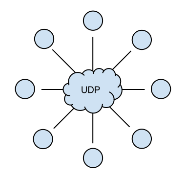
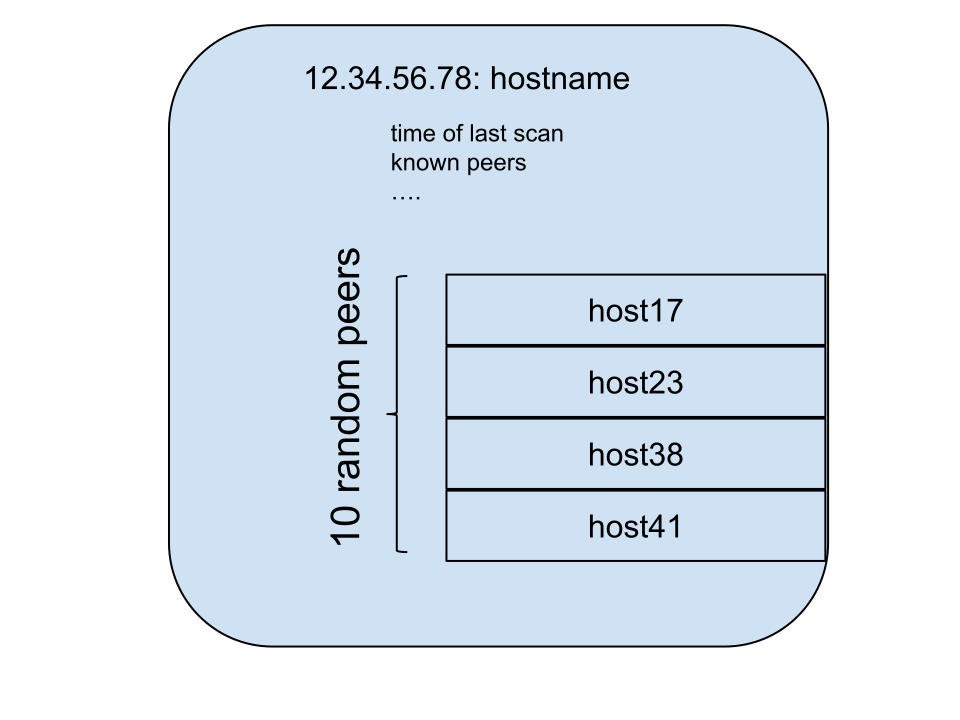
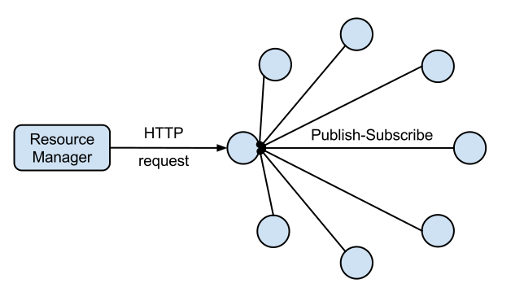
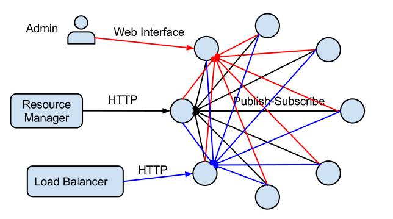
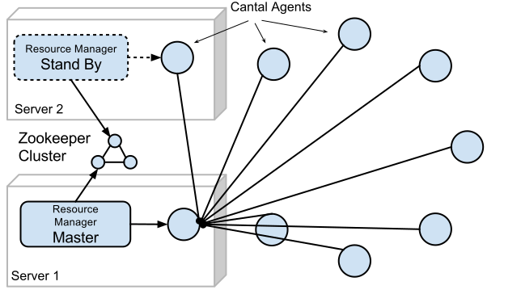

========
Concepts
========

Overview
========

The Cantal is a monitoring system designed specifically for real-time
measuring and load-balancing distributed computing clusters.

The essential part of cantal is a **Cantal Agent** it does the following
things:

* Scans for local metrics at **2 second interval**
* Preserves **one hour** history of all metrics data with *100% precision*
  (compressed)
* Provides **web interface** for viewing local metrics
* Has peer to peer **discovery** mechanism
* On demand provides aggregated statistics **over cluster**

Additional features:

* Cantal is aware of linux containers
* Almost zero-cost connunication between processes and agent
* Written in rust, so can track thousands of metrics with 2 second precision
  in less than couple of percents of a single CPU core

The project also consists of:

* Protocol to submit data to agent at nearly zero cost
* Command-line tool to view data locally without running agent

Background
==========

Since Cantal is designed for real-time load balancing, it has very strong and
very specific requirements:

1. Very high precision (cantal scans at 2 second interval, while common case
   is about a minute interval, very rarely interval is 10 seconds or less)
2. Similarly very fast collection of metrics across large cluster
3. Discovering trends quickly (i.e. having 30 value snapshots per minute we can
   find out load growth in a fraction of minute)
4. High availability (no master, quorum or similar)
5. Being able to observe individual nodes in case of partitioning
6. Lightweight

Design Decisions
================

Here is short roundup of all the important design decisions. Some of them
are described in detail in the following sections.

Agent has embedded web server. So you can point your browser to::

    http://node.domain.in.local.network:22682

..and see all the statistics on the node.

Agent stores history locally. So we don't loose stats in case of
network failure

Agent has peer to peer gossip-like discovery with UDP. So we don't rely on
any other discovery mechanism when time comes to gather metrics over cluster.
Note: we do use UDP only for discovery, so we don't loose statistics when
network is lossy.

You can ask **any instance** of agent to get metrics for whole cluster. This
is how we allow to get data over whole cluster with a single HTTP request. But
we do it *lazily*, so that we don't have full mesh of connections. I.e. when
first client asks, we connect to every node by TCP and subcribe for connections.

Discovery
=========

We have gossip-like peer to peer discovery. You need to add a peer address at
any node and every node will know it.

We use UDP for peer discovery. It works by sending ping packets between
nodes. Each packet contains some critical info about current node and info
about few randomly selected known peers.

Each node sends 5 ping packets with 10 neighbour nodes each second. Each
ping packet receives pong packet with other 10 nodes. Overall it's not very
large number of packets, and packets are distributed uniformly across the
nodes. This allows to discover even large network with thousand of nodes in
few dozens of seconds.

In the future we plan to discover physical topology using UDP packets. In turn
this allows to display graph and provide diagnostics for different kinds of
network partitions (including assymmetric partitions, bridge nodes, etc.)

Note that we use UDP exclusively for peer discovery. This allows us to *avoid*
having a *full mesh* of TCP connections. But we don't use UDP for transferring
metrics, so we don't lose statistics when network suddenly becomes lossy.
Not being able to reach some nodes via UDP in lossy network is definitely the
expected outcome and will help diagnose problems too.

Aggregated Metrics
==================

To have efficient cluster management we consider imporant two points:

1. Resource manager don't have to gather from each node, they must be *pushed*
   as fast as possible
2. We don't want to constrain failover and/or lower the availability of the
   resource manager. I.e. cantal's data should be virtually always available
   for resource manager.

When we talk about *resource manager* (RM) we talk about any software which
consumes metrics and implements some resource allocation decisions. Obviously
resource management is out of scope of the cantal itself.

So to get metrics RM connects to any cantal agent and requests statistics for
all it's peers.

On first request for some monitoring data Cantal Agent does the following:

1. Enables remote peer publish-subscribe subsystem
2. Connects to every known peer via bidirectional protocol (WebSockets in the
   current implementation)
3. Subscribes on each node for the subset of data requested by client
4. Fetches chunk of history for these metrics from every node

.. note:: UDP-based peer tracking and dicovery works always. So every agent
   does know all it's peers. We just activate TCP-based reliable
   publish-subscribe for metrics at request.

Other client might ask another node and that node will seamlessly provide the
stats and historical data.

The only practical limitation of it is the that running a full-mesh of TCP
connections is quite inefficient. So you should poll a single node while it's
still available and switch to another one only when it's not.

.. warn:: It's hard to overstate that you should not poll every node in turn
   otherwise you will have a full mesh of connections and every node will send
   updates to each other every two seconds.

Viewing web interface for **local metrics** and polling for them is perfectly
OK on any and every node.

In perfect world we expect that resource manager will poll an agent on
localhost, and has failover resource manager node with own cantal agent.

